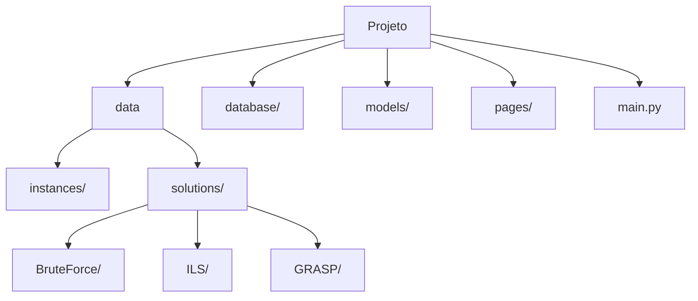

# 🚚 Capacitated Vehicle Routing Problem Dashboard

Este projeto oferece uma solução interativa para visualizar e analisar o Problema de Roteamento de Veículos com Capacidade (CVRP), com suporte a múltiplos métodos de solução:

- 🔍 **BruteForce**
- 🚀 **ILS (Iterated Local Search)**
- 🧠 **GRASP (Greedy Randomized Adaptive Search Procedure)**

---

## 📊 Funcionalidades

- **Análise estatística** das soluções por instância e método
- **Visualização de rotas interativas** com Plotly ou mapas reais com Folium
- **Comparativo gráfico** entre métodos para uma mesma instância
- **Exportação dos dados** (.csv, .xlsx)
- **Simulação de API** para uso externo
- **Geração de imagens** de rotas com destaque do depósito
- **Animação automática** das execuções por instância

---

## 🗂️ Estrutura do Projeto



---

## 🚀 Como Executar

```bash
# 1. Clone o repositório
git clone https://github.com/IsaacKosloski/CapacitatedVehicleRoutingProblem-Dashboard.git
cd CapacitatedVehicleRoutingProblem-Dashboard

# 2. Crie o ambiente virtual
python -m venv venv
source venv/bin/activate  # ou venv\\Scripts\\activate no Windows

# 3. Instale as dependências
pip install -r requirements.txt

# 4. Popule o banco com soluções
python main.py

# 5. Execute o dashboard
streamlit run Home.py
```

---

## 📁 Organização das Soluções

```
data/solutions/
├── BruteForce/
│   └── A/
│       └── A-n32-k5/
│           ├── A-n32-k5-00.sol
│           └── ...
├── ILS/
│   └── ...
└── GRASP/
    └── ...
```

Cada método deve conter subpastas organizadas por grupo (ex: A, B, E...) e por instância.

---

## 📊 Dashboard Multipágina

- **📊 Análise** – estatísticas por instância e método (`1_📊_Analise.py`)
- **🛣️ Rotas** – visualização com animação e mapas (`2_🛣️_Rotas.py`)
- **📊 Comparativo** – gráfico de barras entre métodos (`3_📊_Comparativo.py`)
- **📤 Exportar** – exportação CSV/XLSX + visualização JSON simulada (`4_📤_Exportar.py`)

---

## 🔗 Simulação de API

Na aba **API (Simulada)** da página `📤 Exportar`, é possível visualizar os dados no formato JSON.

Para disponibilizar como API real, recomenda-se usar:
- [FastAPI](https://fastapi.tiangolo.com/)
- [Flask](https://flask.palletsprojects.com/)

---

## 📦 Tecnologias Utilizadas

- Python + Streamlit
- SQLite
- Plotly + Folium
- Pandas, Matplotlib

---